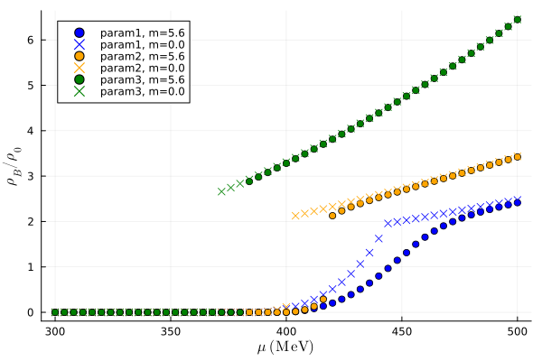
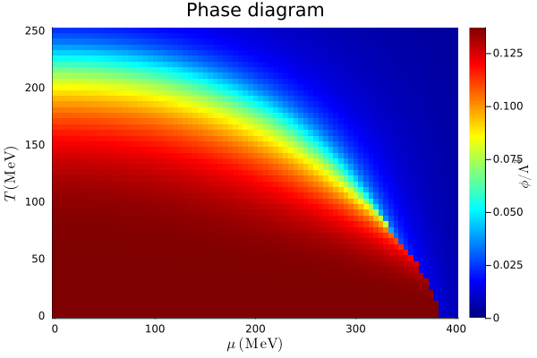

# NJL Model Analysis of Dense Quark Matter

This project implements a numerical analysis of dense quark matter using a two-flavor NJL (Nambu–Jona-Lasinio) model approach. The code primarily calculates thermodynamic quantities such as the grand potential, quark number density, normalized baryon density, pressure, and energy density by solving a self-consistent gap equation for the effective quark mass \(M\) and an effective chemical potential \(\mu_{\text{tilde}}\).
  
  
  

## Features

- **Fermi Occupation Numbers:**  
  - `np(p, T, mu, M)`: Computes the Fermi-Dirac occupation number for quarks.
  - `np_bar(p, T, mu, M)`: Computes the Fermi-Dirac occupation number for antiquarks.

- **Thermodynamic Potential:**  
  - `OmegaM(Temp, μ_t, Mass)`: Computes the free (Fermi-gas) thermodynamic potential.
  - `Omega_temp(T, μ, M, μ_tilde)`: Computes the total thermodynamic potential including interaction terms.

- **Gap Equation and Self-Consistency:**  
  - `gap_eq(M; T, mu)`: Evaluates the gap equation (self-consistency condition) for the effective mass.
  - `find_M(Temp, μ)`: Numerically solves the gap equation to determine the effective mass \(M\).

- **System Solver for Equilibrium:**  
  - `solve_system(T, μ)`: Solves the coupled equations \(\frac{d\Omega}{dM}=0\) and \(\frac{d\Omega}{d\mu_{\text{tilde}}}=0\) using `NLsolve` to obtain the equilibrium values of \(M\) and \(\mu_{\text{tilde}}\).

- **Thermodynamic Quantities:**  
  - `Omega(T, μ)`: Computes the grand potential (relative to vacuum).
  - `num_dens(T, mu, M)`: Computes the total quark number density via 3D momentum integration.
  - `rhoB(T, μ)`: Computes the normalized baryon number density.
  - `pressure(T, μ)`: Computes the pressure.
  - `energy_dens(T, μ)`: Computes the energy density.

## Global Variables

The following global constants are used throughout the analysis for physical quantities and unit conversions. These are defined in the `const.jl` file and should be kept consistent across the computations:

### Physical Constants:
- `hbarc`: Reduced Planck's constant times the speed of light in MeV·fm (\(197.32698044404107\)).
- `rho0`: Nuclear saturation density in fm\(^-3\) (0.17).

### Parameters for the NJL-type Quark Model:
- `Nf`: Number of flavors (2).
- `Nc`: Number of colors (3).
- `Lambda`: Coupling constant (587.9 MeV).
- `Gs`: Coupling constant for the scalar channel (calculated as \(2.44/\Lambda^2\)).
- `Gv`: Coupling constant for the vector channel (same as `Gs`).
- `m`: Quark mass in MeV (5.6).

### Parameters for the Original NJL Model:
- `Nf_o`: Number of flavors (2).
- `Nc_o`: Number of colors (3).
- `Lambda_o`: Coupling constant (587.9 MeV).
- `G`: Coupling constant for the original NJL model (calculated as \(2.44/\Lambda_o^2\)).
- `m_o`: Quark mass in MeV (5.6).

These global constants are crucial for the proper functioning of the model and should be set before performing any calculations.

## References
M. Buballa, Phys. Rept. 407, 205-376 (2005) doi:10.1016/j.physrep.2004.11.004 [arXiv:hep-ph/0402234
[hep-ph]].

## Contributing
Feel free to submit issues or pull requests to improve this project.

## License
This project is licensed under the MIT License. See the LICENSE file for details.

